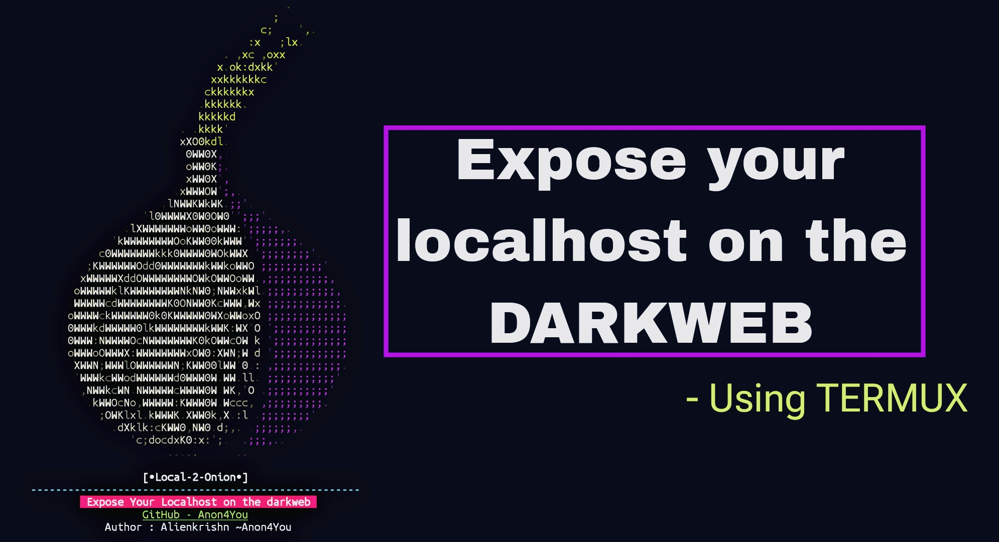

<p align="center">
  
</p>

<p align="center">
  
  
</p>

<p align="center">
  
  
  
  
  </a>
</p>

<p align="center"><b>Expose your localhost on the DARKWEB with Termux.</b></p>

## installation

```
curl -sSL https://github.com/Anon4You/Local2Onion/raw/main/install | bash
```

> just copy and paste this command in your termux
* note if rawgithub not connected use a vpn or proxy


